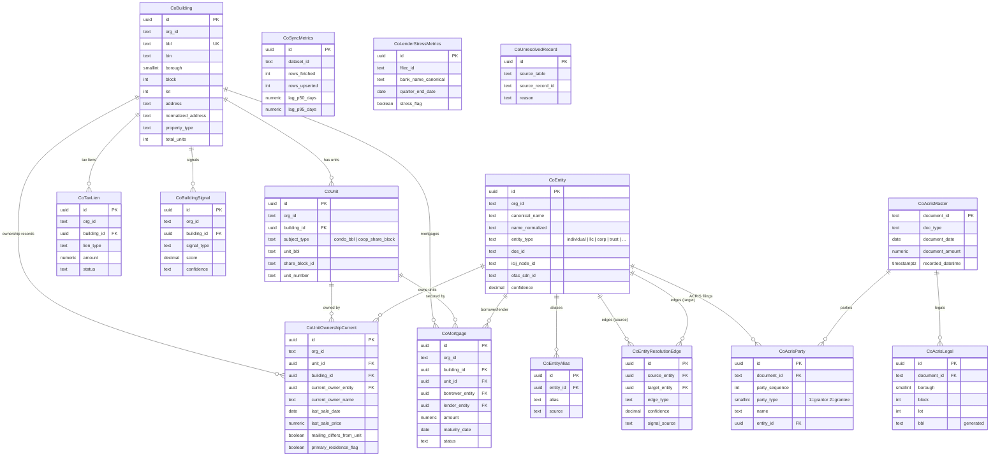

# Building Intelligence Spine — Schema Reference

Phase 1 of the Building Intelligence Overhaul. All new tables live in the `condo_ownership` Postgres schema.

## ER Diagram

## Table Descriptions

### Core Spine

| Table | Description |
|-------|-------------|
| `condo_ownership.buildings` | Canonical building spine. Every NYC building resolves to one row. Keyed by `(org_id, bbl)`. BBL is the billing BBL (parent lot for condos). |
| `condo_ownership.units` | Individual units within a building. `subject_type` discriminates condo (BBL-keyed via `unit_bbl`) from co-op (share-block-keyed via `share_block_id`). |

### Entity Graph

| Table | Description |
|-------|-------------|
| `condo_ownership.entities` | Every owner ever seen — humans, LLCs, corps, trusts, estates. Canonical name + normalized name for fuzzy matching. Cross-references: NY DOS, ICIJ, OFAC, IRS EIN. |
| `condo_ownership.entity_aliases` | Alternate names for entities, with source attribution. |
| `condo_ownership.entity_resolution_edges` | Confidence-scored relationships: `principal_of`, `spouse_of`, `agent_of`, `sponsor_of`, `shared_address`, `related_llc`. |

### ACRIS Mirror

| Table | Description |
|-------|-------------|
| `condo_ownership.acris_master` | Mirrored ACRIS document records. PK on `document_id`. |
| `condo_ownership.acris_legals` | ACRIS legal references with generated `bbl` column for joins. |
| `condo_ownership.acris_parties` | ACRIS party records with `party_sequence` (fixes PK collision from original spec). FK to `entities` for resolved names. |

### Ownership & Debt

| Table | Description |
|-------|-------------|
| `condo_ownership.unit_ownership_current` | Denormalized current-owner lookup. The read endpoint hits this table. Includes investor badge (`mailing_differs_from_unit`), primary residence flag, STAR enrollment. |
| `condo_ownership.mortgages` | Active/satisfied mortgages per building or unit. Entity FKs for borrower and lender. |
| `condo_ownership.tax_liens` | Tax lien sale records from Socrata `9rz4-mjek`. |

### Signals & Instrumentation

| Table | Description |
|-------|-------------|
| `condo_ownership.lender_stress_metrics` | FFIEC Call Report bank stress metrics per quarter. |
| `condo_ownership.building_signals` | Computed distress/opportunity signals per building (forced-sale candidate, lender stress exposure, etc.). |
| `condo_ownership.sync_metrics` | Per-dataset ingest run metrics with P50/P95 lag tracking. |
| `condo_ownership.unresolved_records` | Orphaned ingest rows that couldn't resolve to a Building. |

### Existing Table FK Additions (Migration 10)

| Table | New Column | Purpose |
|-------|-----------|---------|
| `portfolios` | `building_id` | Links portfolio to canonical building spine |
| `portfolio_buildings` | `building_id` | Links portfolio building entry to spine |
| `prospecting_items` | `building_id` | Links prospect to spine |
| `building_cache` | `building_id` | Links cache entry to spine |
| `terminal_events` | `building_id` | Links terminal event to spine |

All `building_id` columns are nullable. Existing queries continue to work unchanged. Phase 2 data migration populates these columns.

### DatasetConfig `kind` Discriminator

The `DatasetConfig` interface in `src/lib/terminal-datasets.ts` now has a `kind` field:

| Kind | Routing | Examples |
|------|---------|----------|
| `event` | Writes to `TerminalEvent` | DOB permits, HPD violations, ECB penalties |
| `snapshot` | Writes to `BuildingCache` or spine tables | HPD MDR, tax liens, DOF assessment |
| `join-driven` | Multi-table join before write | ACRIS (Master+Legals+Parties), RPTT |
